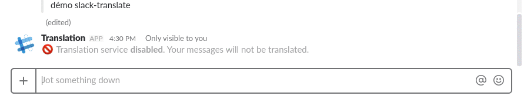

# Slack Translate

Translate slack messages on the fly.

## Slack Slash Commands
`/lang [language]` Translate messages into the specified language. 
If no language is specified, then the translation service is disabled.

A list of valid languages can be found [here](https://github.com/matheuss/google-translate-api/blob/master/languages.js).
You can use either the language name (case insensitive) or the two letter IS0-639-1 code.

For example, typing `/lang French`, will result in messages being translated into French, as will `/lang french` and `/lang fr`.

Typing `/lang` will disable the message service. 

## Environment Variables

The following environment variables must be defined in a `.env` file living in the same directory from which `npm start is called`.
The file should define the following keys:
- SLACK_VERIFICATION_TOKEN
- SLACK_API_TOKEN
- SQLITE_FILE_PATH

See the [dotenv documentation](https://github.com/motdotla/dotenv) for more information.
